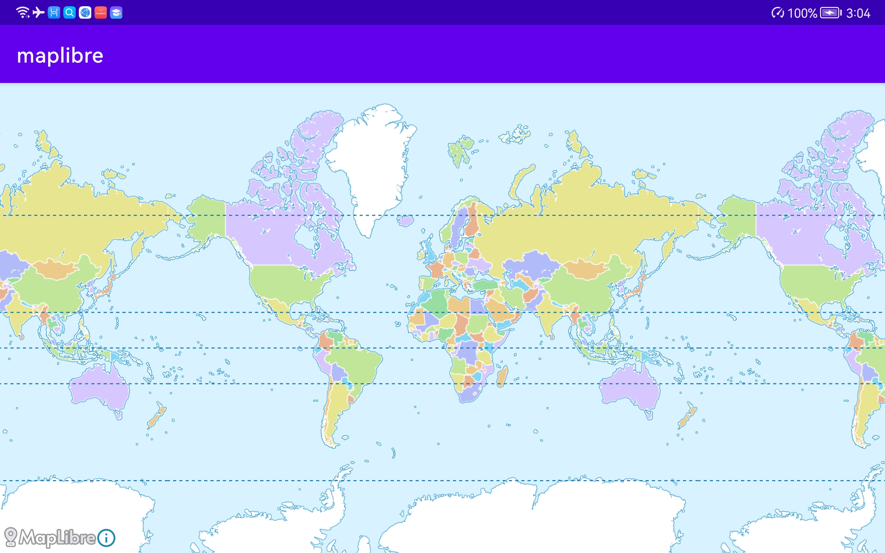
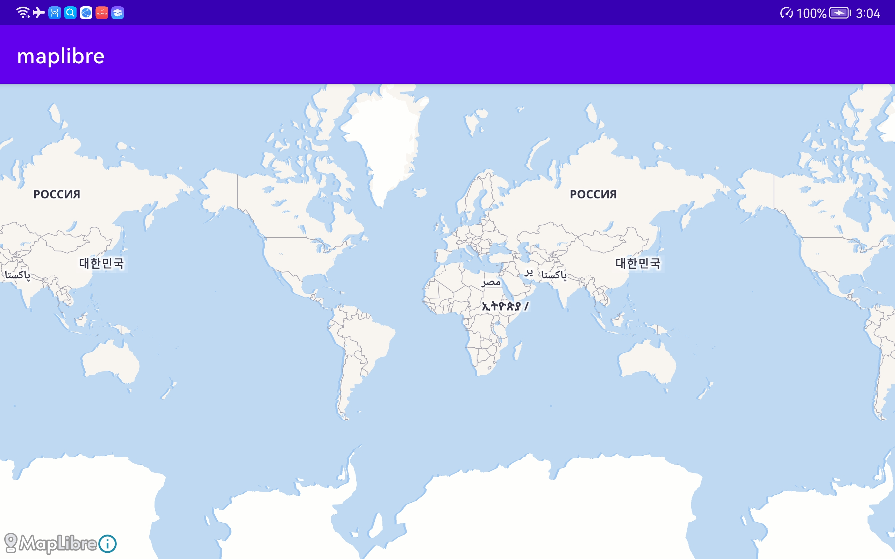
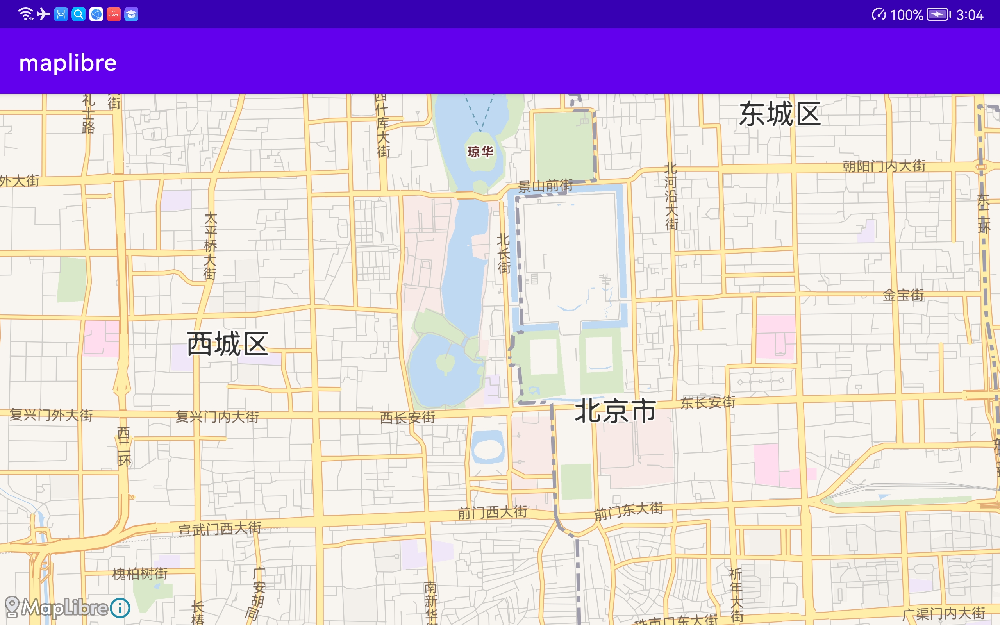

# MapLibre Native Example online and offline

## Reference

- [maplibre-native](https://github.com/maplibre/maplibre-native/tree/main)
- [MapLibre Native for Android](https://maplibre.org/maplibre-native/android/api/index.html)
- [MapLibre Native for Android - Quickstart](https://maplibre.org/maplibre-native/docs/book/android/getting-started-guide.html)
- [How to display offline maps using Maplibre/Mapbox on Android](https://medium.com/@ty2/how-to-display-offline-maps-using-maplibre-mapbox-39ad0f3c7543)
- [osm2vectortiles-android](https://github.com/roblabs/osm2vectortiles-android)

## Description

Use online data by default

Using local data, modify the `app/src/main/java/com/icu/maplibre/MainActivity.java` file to use 49 lines of code

## Change local data

Download local data

- [Map Tiler Data](https://data.maptiler.com/downloads/planet/)

Change local data, modify code

1. `app/src/main/assets/styles/offline.json` -> `beijing_maptiler.mbtiles` 变更为新的文件地址
2. `app/src/main/java/com/icu/maplibre/MainActivity.java` -> `beijing_maptiler.mbtiles` 变更为新的文件地址
